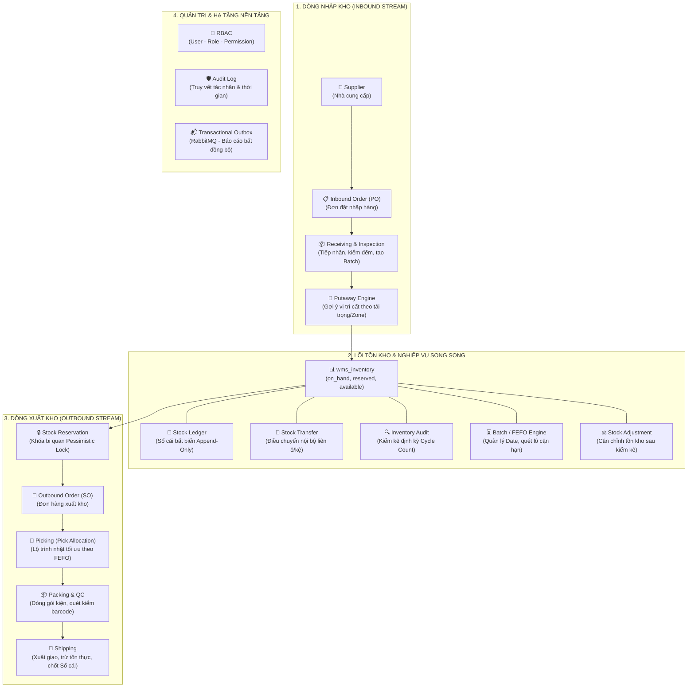
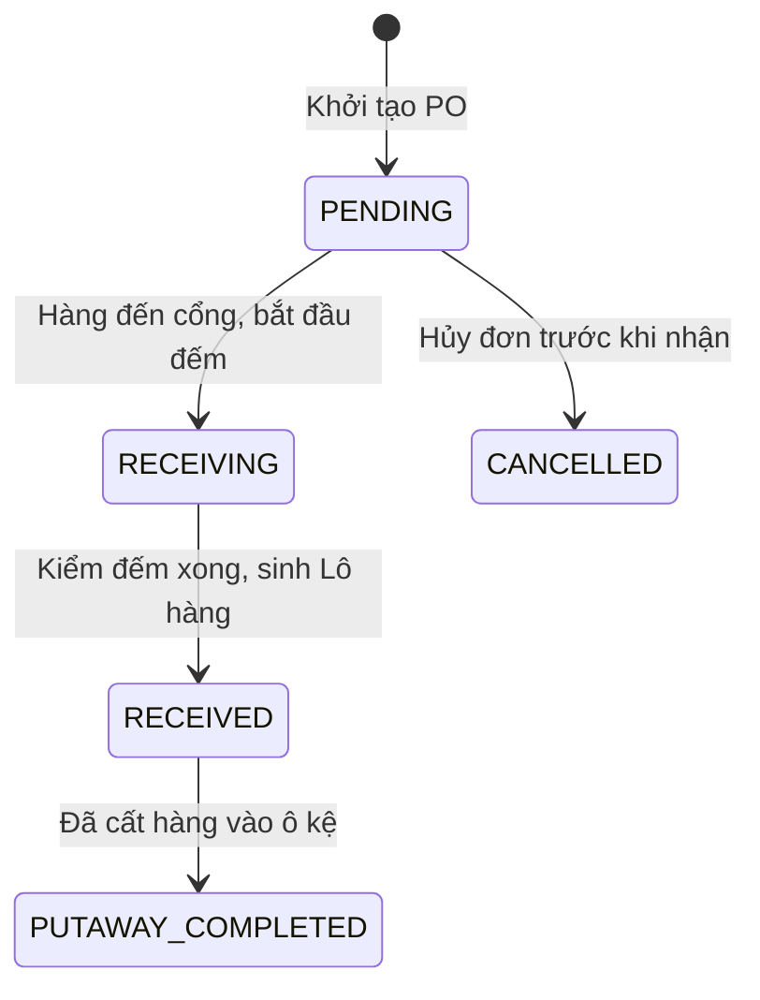
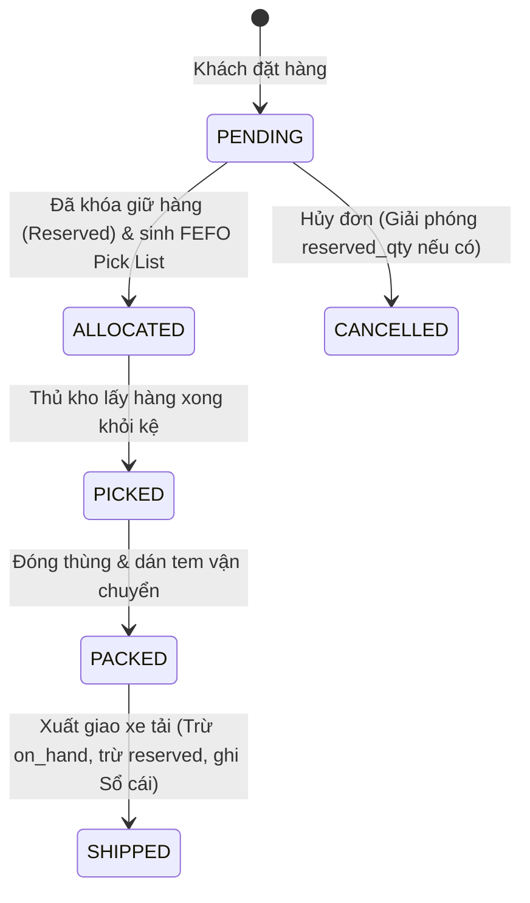
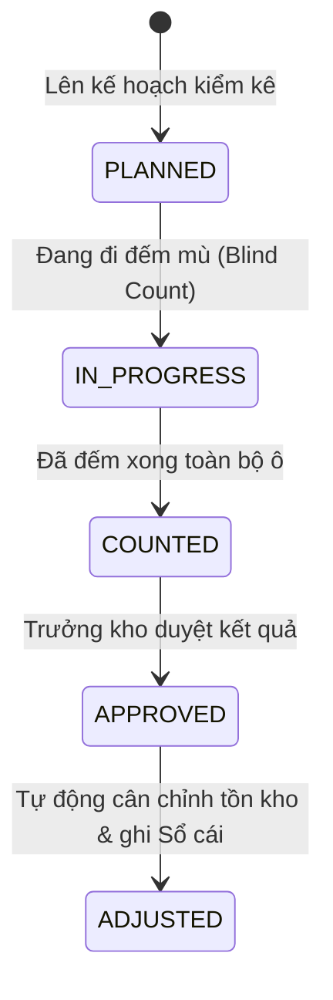

# TÀI LIỆU ĐẶC TẢ LUỒNG DỮ LIỆU & QUY TẮC BẤT BIẾN NGHIỆP VỤ (SMART WMS)
> **Đề tài:** Hệ Thống Quản Lý Kho Hàng Thông Minh (Event-Driven Modular Monolith)  
> **Dành cho:** Nhóm đồ án tốt nghiệp 2 thành viên (Chuẩn Doanh Nghiệp)  
> **Mục tiêu:** Cẩm nang kiến trúc, luồng dữ liệu chi tiết, các bất biến kỹ thuật (Invariants) và nguyên tắc cốt tử cần nắm vững trước và trong quá trình phát triển.

---

## MỤC LỤC
1. [SƠ ĐỒ KIẾN TRÚC TỔNG THỂ CỦA MỘT WMS DOANH NGHIỆP](#1-sơ-đồ-kiến-trúc-tổng-thể-của-một-wms-doanh-nghiệp)
2. [CHI TIẾT LUỒNG DỮ LIỆU TỪNG CHẶNG (DATA FLOW PIPELINE)](#2-chi-tiết-luồng-dữ-liệu-từng-chặng-data-flow-pipeline)
   - [2.1. Dòng Nhập Kho (Inbound Stream)](#21-dòng-nhập-kho-inbound-stream)
   - [2.2. Lõi Tồn Kho & Các Nghiệp Vụ Song Song (Core Inventory & Parallel Operations)](#22-lõi-tồn-kho--các-nghiệp-vụ-song-song-core-inventory--parallel-operations)
   - [2.3. Dòng Xuất Kho & Giao Vận (Outbound Stream)](#23-dòng-xuất-kho--giao-vận-outbound-stream)
   - [2.4. Phân Hệ Quản Trị & Hạ Tầng (Governance & Event-Driven Platform)](#24-phân-hệ-quản-trị--hạ-tầng-governance--event-driven-platform)
3. [6 NGUYÊN TẮC CỐT TỬ & BẤT BIẾN KỸ THUẬT (CRITICAL INVARIANTS)](#3-6-nguyên-tắc-cốt-tử--bất-biến-kỹ-thuật-critical-invariants)
4. [BẢN ĐỒ STATE MACHINE (MÁY TRẠNG THÁI CÁC ĐƠN TỪ)](#4-bản-đồ-state-machine-máy-trạng-thái-các-đơn-từ)
5. [PHÂN CÔNG TRÁCH NHIỆM & KỊCH BẢN PHẢN BIỆN (2 THÀNH VIÊN)](#5-phân-công-trách-nhiệm--kịch-bản-phản-biện-2-thành-viên)

---

## 1. SƠ ĐỒ KIẾN TRÚC TỔNG THỂ CỦA MỘT WMS DOANH NGHIỆP

Một hệ thống WMS chuẩn mực không phải là tập hợp các bảng rời rạc mà là một **Dòng chảy dữ liệu khép kín (End-to-End Pipeline)** với các nghiệp vụ vệ tinh hỗ trợ:



---

## 2. CHI TIẾT LUỒNG DỮ LIỆU TỪNG CHẶNG (DATA FLOW PIPELINE)

### 2.1. Dòng Nhập Kho (Inbound Stream)

```
Supplier ──► Inbound Order ──► Receiving ──► Putaway ──► wms_inventory
```

1. **Bước 1: Nhà cung cấp (Supplier) & Danh mục cung ứng (`wms_supplier`, `wms_supplier_product`)**
   - Quản lý Master data nhà cung cấp, mã sản phẩm của NCC (`supplier_sku`), đơn giá nhập (`purchase_price`), thời gian giao hàng (`lead_time_days`), và cờ nhà cung cấp ưu tiên (`is_preferred`).
2. **Bước 2: Đơn đặt hàng nhập kho (`wms_inbound_order`, `wms_inbound_order_item`)**
   - Tạo PO với trạng thái khởi tạo `PENDING`.
   - Mỗi dòng đơn chứa: `product_id`, số lượng dự kiến (`expected_qty`), đơn giá, và dung sai vượt giao cho phép (`over_delivery_tolerance_pct` - mặc định 10%).
3. **Bước 3: Tiếp nhận & Kiểm tra chất lượng (Receiving & Inspection)**
   - Hàng về cửa tiếp nhận (Dock), nhân viên quét Barcode kiểm tra sản phẩm.
   - Cập nhật số lượng thực nhận (`received_qty`). Nếu `received_qty > expected_qty * (1 + tolerance_pct / 100)`, hệ thống chặn không cho nhận vượt mức.
   - Khởi tạo Lô hàng trong `wms_product_batch`: `batch_number`, ngày sản xuất (`manufacture_date`), hạn sử dụng (`expiry_date`), và trạng thái lô (`ACTIVE` nếu đạt chuẩn, `QUARANTINE` nếu cần kiểm định mẫu).
   - Chuyển trạng thái đơn: `PENDING` $\rightarrow$ `RECEIVING` $\rightarrow$ `RECEIVED`.
4. **Bước 4: Cất hàng vào kệ (Putaway Engine)**
   - Hệ thống chạy giải thuật `suggestOptimalPutAwayLocation(preferredZone, itemWeight)`:
     - Lọc các ô kệ hoạt động (`is_active = true`) thuộc đúng Zone nhiệt độ (Zone A: Khô, Zone B: Mát).
     - Kiểm tra sức chứa tải trọng: `location.max_weight_kg >= itemWeight`.
     - Với hàng nặng (> 100kg): tự động ưu tiên tầng trệt (`Shelf = S01`) để đảm bảo an toàn kết cấu kệ.
   - Khi nhân viên cất hàng vào ô và quét xác nhận:
     - Tăng số lượng thực tế: `wms_inventory.on_hand_qty += received_qty`.
     - Ghi nhận bút toán vào Sổ cái `wms_stock_ledger` với `transaction_type = 'INBOUND'`.

---

### 2.2. Lõi Tồn Kho & Các Nghiệp Vụ Song Song (Core Inventory & Parallel Operations)

Lõi tồn kho là "trái tim" của hệ thống, quản lý số dư và tính toàn vẹn thông qua các nghiệp vụ song song:

#### A. Bộ 3 Bất Biến Tồn Kho (`wms_inventory`)
- `on_hand_qty`: Tồn kho vật lý thực tế có trong ô kệ.
- `reserved_qty`: Số lượng đã được giữ chỗ cho các đơn xuất hàng (chưa mang ra khỏi kho).
- `available_qty`: Số lượng còn lại thực sự có thể bán/xuất.
- **Ràng buộc Database bắt buộc:**
  ```sql
  CONSTRAINT chk_reserved_le_onhand CHECK (reserved_qty <= on_hand_qty)
  available_qty INT GENERATED ALWAYS AS (on_hand_qty - reserved_qty) STORED
  ```

#### B. Sổ Cái Thẻ Kho Bất Biến (`wms_stock_ledger`)
- Mọi biến động tăng/giảm tồn kho đều phải ghi một dòng vào `wms_stock_ledger`.
- Bảng có Trigger `trg_stock_ledger_prevent_modification` **chặn 100% lệnh UPDATE và DELETE** (Append-Only Audit Log).
- Cột `balance_after`: Ghi nhận chính xác số dư `on_hand_qty` ngay sau biến động.
- Trigger `trg_validate_stock_ledger_balance` sẽ tự động đối soát: nếu `balance_after != wms_inventory.on_hand_qty`, transaction lập tức bị `ROLLBACK`.

#### C. Điều Chuyển Nội Bộ (`wms_stock_transfer`)
- Cho phép di chuyển hàng hóa giữa các ô/kệ (để gom hàng, dọn ô, hoặc cân bằng tải trọng kệ).
- Trigger `trg_wms_stock_transfer_warehouse_check` bắt buộc: `from_location_id` và `to_location_id` phải cùng thuộc `warehouse_id` của lệnh điều chuyển.

#### D. Kiểm Kê Thực Tế Định Kỳ (`wms_inventory_audit`, `wms_inventory_audit_item`)
- Áp dụng kỹ thuật kiểm kê mù (Blind Count): nhân viên đi đếm thực tế `counted_qty` mà không nhìn thấy trước số hệ thống.
- Cột tự sinh: `difference_qty = counted_qty - system_qty`.
- Khóa ngoại phức hợp `fk_audit_item_inventory` bắt buộc: chỉ được kiểm kê bộ ba `(location_id, product_id, batch_id)` thực sự tồn tại trong `wms_inventory`.

#### E. Quản Lý Hạn Dùng & Giải Thuật FEFO (`wms_product_batch`)
- Quản lý trạng thái lô: `ACTIVE` (được xuất), `QUARANTINE` (cách ly), `EXPIRED` (hết hạn), `RECALLED` (thu hồi).
- Partial Index chuyên biệt:
  ```sql
  CREATE INDEX idx_batch_fefo_active 
  ON wms_product_batch(product_id, expiry_date ASC NULLS LAST) 
  WHERE status = 'ACTIVE';
  ```
  Giúp Database Engine tối ưu hóa đường dẫn truy vấn bằng **Index Scan** thay vì quét tuần tự toàn bộ bảng (Sequential Scan).

#### F. Cân Chỉnh Tồn Kho (Stock Adjustment)
- Khi phiếu kiểm kê được Trưởng kho phê duyệt (`APPROVED`):
  - Với các dòng lệch (`DISCREPANCY`): Cập nhật lại `wms_inventory.on_hand_qty = counted_qty`.
  - Ghi bút toán điều chỉnh vào `wms_stock_ledger` với `transaction_type = 'ADJUSTMENT'`.

---

### 2.3. Dòng Xuất Kho & Giao Vận (Outbound Stream)

```
wms_inventory ──► Reservation ──► Outbound Order ──► Picking (FEFO) ──► Packing ──► Shipping
```

1. **Bước 1: Khóa giữ hàng an toàn (Stock Reservation - `InventoryLockService`)**
   - Khi đơn hàng phát sinh, hệ thống không trừ `on_hand_qty` ngay mà gọi `reserveStock(...)`.
   - Sử dụng **Pessimistic Locking (`SELECT FOR UPDATE`)** trên dòng `wms_inventory` tương ứng.
   - Kiểm tra `available_qty >= requestedQty`. Nếu đủ, tăng `reserved_qty += requestedQty`.
   - **Mục đích:** Đảm bảo hàng không bị bán trùng (Overselling) ngay cả khi có 100 yêu cầu đồng thời truy cập cùng 1 mặt hàng.
2. **Bước 2: Đơn xuất hàng (`wms_outbound_order`, `wms_outbound_order_item`)**
   - Chuyển trạng thái đơn: `PENDING` $\rightarrow$ `ALLOCATED`.
3. **Bước 3: Phân bổ & Sinh lộ trình nhặt hàng (Picking - `OutboundService`)**
   - Hệ thống quét các Lô còn hạn sử dụng gần nhất theo giải thuật FEFO.
   - Tạo bản ghi trong `wms_pick_allocation` (đầy đủ `outbound_order_item_id`, `product_id`, `location_id`, `batch_id`, `allocated_qty`).
   - Sắp xếp thứ tự các điểm dừng lấy hàng (Pick List) tối ưu theo tọa độ: `Aisle` $\rightarrow$ `Rack` $\rightarrow$ `Shelf` để nhân viên nhặt hàng đi theo 1 chiều duy nhất, không phải đi vòng vèo.
   - Sau khi nhặt xong, chuyển trạng thái sang `PICKED`.
4. **Bước 4: Đóng gói & Kiểm đếm chất lượng (Packing & QC)**
   - Hàng được tập kết về bàn đóng gói (Packing Station).
   - Nhân viên quét mã Barcode từng sản phẩm để đối chiếu với Pick List, đóng thùng, dán nhãn vận chuyển (Shipping Label).
   - Chuyển trạng thái sang `PACKED`.
5. **Bước 5: Giao vận & Chốt sổ xuất kho (Shipping)**
   - Hàng được bàn giao cho tài xế/đơn vị vận chuyển.
   - Chuyển trạng thái đơn sang `SHIPPED`.
   - **Thao tác dữ liệu cuối cùng:**
     - Giải phóng số lượng đã giữ: `reserved_qty -= qty`.
     - Trừ số lượng thực tế: `on_hand_qty -= qty`.
     - Ghi nhận bút toán xuất kho vào Sổ cái `wms_stock_ledger` (`transaction_type = 'OUTBOUND'`).

---

### 2.4. Phân Hệ Quản Trị & Hạ Tầng (Governance & Event-Driven Platform)

1. **Phân quyền RBAC chuẩn doanh nghiệp:**
   - Người dùng gắn với nhiều vai trò qua `wms_user_role`.
   - Vai trò gắn với nhiều quyền qua `wms_role_permission`.
   - Tuyệt đối không dùng `wms_user.role_id` đơn lẻ để đảm bảo tính mở rộng linh hoạt.
2. **Truy vết kiểm toán (Audit Trail):**
   - Mọi bảng giao dịch đều lưu vết: `created_by`, `performed_by`, `approved_by` liên kết trực tiếp tới `wms_user(id)`.
   - Thời gian chuẩn múi giờ quốc tế: `TIMESTAMPTZ DEFAULT CURRENT_TIMESTAMP`.
3. **Transactional Outbox & Xử lý bất đồng bộ (RabbitMQ):**
   - Các thao tác xuất báo cáo nặng (kết xuất hàng triệu dòng lịch sử) không chạy đồng bộ trên REST API.
   - Service ghi nhận task vào bảng `wms_report_job` và đẩy message vào hàng đợi RabbitMQ (`report.export.queue`).
   - `ExcelStreamingWorker` ngầm lấy task, dùng Apache POI `SXSSFWorkbook` (Streaming) kết xuất trực tiếp lên MinIO S3, sau đó cập nhật trạng thái `COMPLETED` kèm link tải an toàn.

---

## 3. 6 NGUYÊN TẮC CỐT TỬ & BẤT BIẾN KỸ THUẬT (CRITICAL INVARIANTS)

Trước khi viết bất kỳ dòng code Service hay Controller nào, **cả 2 thành viên bắt buộc phải tuân thủ nghiêm ngặt 6 nguyên tắc sau**:

### ⚠️ Nguyên tắc 1: Thứ tự Transaction Sổ Cái (Ledger Protocol)
> **Quy tắc bắt buộc:**
> 1. Bước 1: `UPDATE wms_inventory` (cập nhật số dư `on_hand_qty` mới)
> 2. Bước 2: `INSERT wms_stock_ledger` (ghi `balance_after` = số dư mới vừa cập nhật)
>
> **Lý do:** Trigger CSDL `trg_validate_stock_ledger_balance` đọc `wms_inventory.on_hand_qty` trong cùng transaction để đối soát. Nếu làm ngược lại (Insert Sổ cái trước khi Update Tồn kho), trigger sẽ chặn và bắn exception:
> `VI PHẠM ĐỐI SOÁT SỐ DƯ: balance_after không khớp với on_hand_qty!`

### ⚠️ Nguyên tắc 2: Thứ tự Khóa dữ liệu chống Deadlock (Lock Ordering)
> Khi một đơn hàng xuất cần giữ hàng cho nhiều mặt hàng/nhiều ô kệ cùng lúc:
> - **Luôn sắp xếp thứ tự các ô cần khóa theo ID tăng dần (`location_id ASC, product_id ASC, batch_id ASC`) trước khi gọi `SELECT ... FOR UPDATE`.**
> - **Lý do:** Nếu Luồng 1 khóa A rồi khóa B, trong khi Luồng 2 khóa B rồi khóa A $\rightarrow$ PostgreSQL sẽ xảy ra **Deadlock** và huỷ một trong hai giao dịch. Sắp xếp thứ tự khóa triệt tiêu 100% nguy cơ Deadlock.

### ⚠️ Nguyên tắc 3: Tính Bất Biến Tuyệt Đối của Sổ Cái (Ledger Immutability)
> - Bảng `wms_stock_ledger` là tài liệu pháp lý và kế toán kho. **Không bao giờ được viết câu lệnh UPDATE hoặc DELETE trên bảng này.**
> - Nếu phát hiện số liệu sai lệch hoặc hàng hỏng: BẮT BUỘC thực hiện giao dịch bù trừ (Compensating Transaction) bằng cách chèn thêm một dòng mới với `transaction_type = 'ADJUSTMENT'`.

### ⚠️ Nguyên tắc 4: Ranh Giới Toàn Vẹn Kho (Warehouse Isolation)
> - Một đơn điều chuyển `wms_stock_transfer` chỉ hợp lệ khi cả ô xuất phát (`from_location_id`) và ô đích đến (`to_location_id`) đều cùng thuộc `warehouse_id` của lệnh đó.
> - Trigger `trg_wms_stock_transfer_warehouse_check` đã được cài đặt sẵn tại tầng CSDL để cưỡng chế quy tắc này.

### ⚠️ Nguyên tắc 5: Ràng Buộc Phân Bổ Nhặt Hàng (Pick Allocation Integrity)
> - Bảng `wms_pick_allocation` bắt buộc phải có trường `product_id`.
> - Ràng buộc khóa ngoại phức hợp đảm bảo: Sản phẩm được nhặt (`product_id`) phải trùng khớp 100% với Sản phẩm của dòng đơn hàng (`outbound_order_item.product_id`) và Sản phẩm của lô hàng (`product_batch.product_id`). Tuyệt đối không thể nhặt nhầm quả táo cho dòng đơn mua quả cam.

### ⚠️ Nguyên tắc 6: Chuẩn Xác Khi Thuyết Minh Kỹ Thuật (No False Claims)
> - **Không tuyên bố:** *"Thuật toán FEFO chạy với độ phức tạp O(log N)"* khi bảo vệ trước Hội đồng.
> - **Cách giải thích chuẩn kỹ thuật phần mềm:** *"Hệ thống sử dụng Partial B-Tree Index lọc trước các lô trạng thái ACTIVE và sắp xếp theo hạn sử dụng. Điều này giúp Database Planner chọn đường dẫn **Index Scan / Index Range Scan** thay vì phải quét toàn bộ bảng **Sequential Scan**, giảm thiểu I/O đĩa từ hàng nghìn block xuống chỉ vài phép đọc index."* (Chứng minh bằng `EXPLAIN ANALYZE`).

---

## 4. BẢN ĐỒ STATE MACHINE (MÁY TRẠNG THÁI CÁC ĐƠN TỪ)

Để giao diện Frontend và API Backend không bị lỗi nhảy cóc bước, hãy tuân thủ vòng đời trạng thái sau:

### 1. Inbound Order (Đơn Nhập Kho)


### 2. Outbound Order (Đơn Xuất Kho)


### 3. Inventory Audit (Phiếu Kiểm Kê)


---

## 5. PHÂN CÔNG TRÁCH NHIỆM & KỊCH BẢN PHẢN BIỆN (2 THÀNH VIÊN)

### 🧑‍💻 Thành viên A: Lead Inbound, Master Data & Infrastructure
- **Phạm vi code:**
  - Master Data Kho (`Warehouse`, `Location`, `Category`, `Supplier`, `Product`).
  - Toàn bộ dòng Inbound (`InboundOrder`, `Receiving`, `Putaway Algorithm`).
  - Quản trị bảo mật RBAC (`User`, `Role`, `Permission`), Sổ cái `Stock Ledger`, Transactional Outbox.
- **Kịch bản trả lời Hội đồng:**
  - *"Em chịu trách nhiệm thiết kế mô hình dữ liệu Master Data chuẩn hóa, giải thuật cất hàng Putaway tối ưu theo khu vực/tải trọng kệ, và cơ chế bảo vệ tính toàn vẹn bất biến của Sổ cái Thẻ kho bằng Database Trigger."*

### 🧑‍💻 Thành viên B: Lead Outbound, Inventory Optimization & AI/Analytics
- **Phạm vi code:**
  - Quản lý tồn kho đa luồng: `InventoryLockService` (Pessimistic Locking `SELECT FOR UPDATE` chống bán lố).
  - Toàn bộ dòng Outbound: Giải thuật FEFO, `Pick Allocation`, sinh lộ trình nhặt hàng tối ưu theo tọa độ kệ, `Packing & Shipping`.
  - Nghiệp vụ Kiểm kê (`Inventory Audit`), Báo cáo bất đồng bộ qua RabbitMQ + MinIO, và Trợ lý AI Smart Query.
- **Kịch bản trả lời Hội đồng:**
  - *"Em chịu trách nhiệm giải quyết bài toán Concurrency khi nhiều đơn hàng cùng tranh chấp tồn kho bằng Khóa bi quan, giải thuật xuất hàng cận date FEFO kết hợp tối ưu lộ trình nhặt hàng, cùng kiến trúc xử lý tác vụ nặng bất đồng bộ với Message Queue."*
