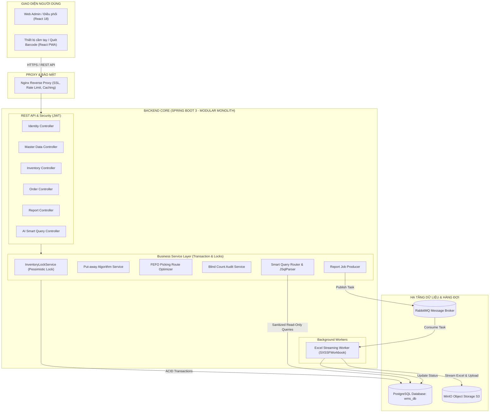
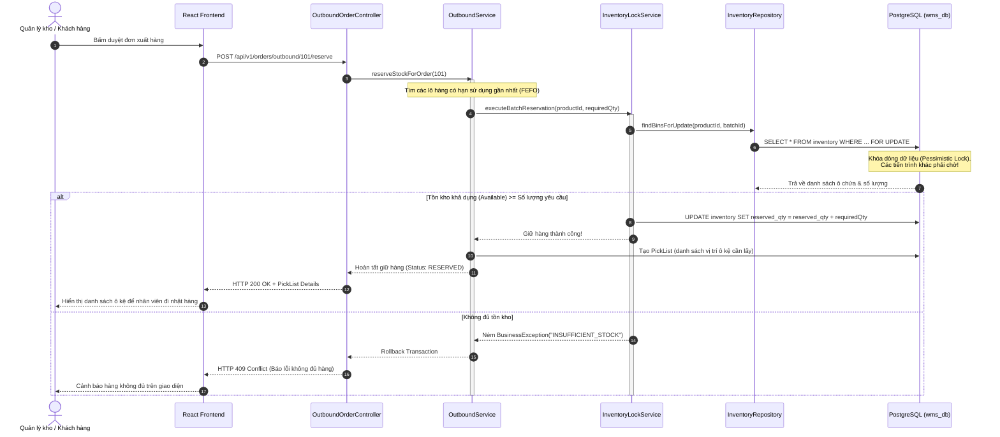
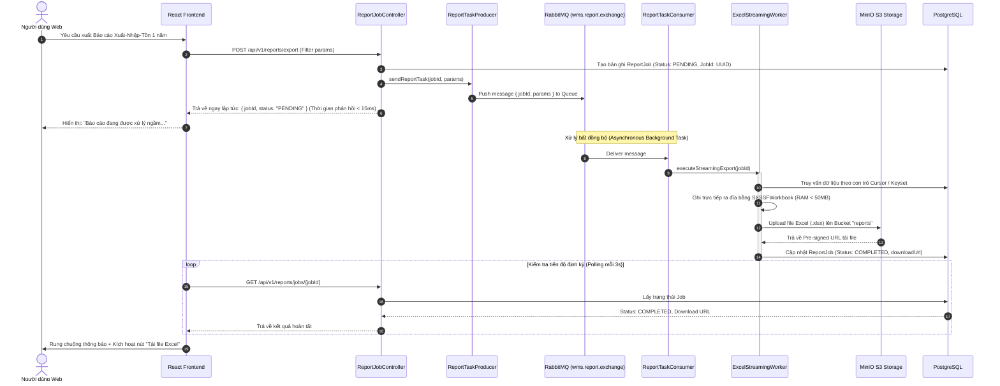
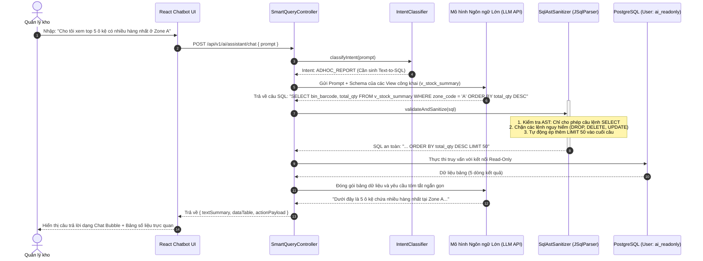

# TÀI LIỆU ĐẶC TẢ KIẾN TRÚC HỆ THỐNG QUẢN LÝ KHO THÔNG MINH (SMART WMS)
> **Đề tài Đồ án Tốt nghiệp / Dự án Doanh nghiệp:** Hệ Thống Quản Lý Kho Hàng Thông Minh Tích Hợp AI & Hàng Đợi Bất Đồng Bộ  
> **Kiến trúc chủ đạo:** Event-Driven Modular Monolith (Nguyên khối theo Phân hệ kết hợp Hướng sự kiện)  
> **Tech Stack:** Java Spring Boot 3, React 18 TypeScript, PostgreSQL, RabbitMQ, MinIO, Docker, Nginx.

---

## MỤC LỤC
1. [TỔNG QUAN VỀ KIẾN TRÚC HỆ THỐNG](#1-tổng-quan-về-kiến-trúc-hệ-thống)
2. [CÂY CẤU TRÚC THƯ MỤC TOÀN DIỆN](#2-cây-cấu-trúc-thư-mục-toàn-diện)
3. [BÓC TÁCH CHI TIẾT TỪNG TẦNG VÀ PHÂN HỆ (DEEP-DIVE)](#3-bóc-tách-chi-tiết-từng-tầng-và-phân-hệ-deep-dive)
   - [3.1. Tầng Hạ tầng & Điều phối (DevOps / Docker)](#31-tầng-hạ-tầng--điều-phối-devops--docker)
   - [3.2. Backend: Tầng Dùng Chung (Common Layer)](#32-backend-tầng-dùng-chung-common-layer)
   - [3.3. Module 1: Định danh & Phân quyền (Identity & RBAC)](#33-module-1-định-danh--phân-quyền-identity--rbac)
   - [3.4. Module 2: Dữ liệu Master & Sơ đồ Vị trí Kho (Master Data & Location)](#34-module-2-dữ-liệu-master--sơ-đồ-vị-trí-kho-master-data--location)
   - [3.5. Module 3: Lõi Quản lý Tồn kho & Kiểm soát Đồng thời (Core Inventory)](#35-module-3-lõi-quản-lý-tồn-kho--kiểm-soát-đồng-thời-core-inventory)
   - [3.6. Module 4: Quản lý & Điều phối Đơn hàng (Order Management)](#36-module-4-quản-lý--điều-phối-đơn-hàng-order-management)
   - [3.7. Module 5: Báo cáo Nặng Bất đồng bộ với RabbitMQ & MinIO (Heavy Reporting)](#37-module-5-báo-cáo-nặng-bất-đồng-bộ-với-rabbitmq--minio-heavy-reporting)
   - [3.8. Module 6: Trợ lý AI Truy vấn Thông minh (Smart Query & Safe Text-to-SQL)](#38-module-6-trợ-lý-ai-truy-vấn-thông-minh-smart-query--safe-text-to-sql)
   - [3.9. Frontend: React 18 + TypeScript + Vite](#39-frontend-react-18--typescript--vite)
4. [SƠ ĐỒ CÁC LUỒNG NGHIỆP VỤ QUAN TRỌNG (SEQUENCE FLOWS)](#4-sơ-đồ-các-luồng-nghiệp-vụ-quan-trọng-sequence-flows)
   - [Luồng 1: Xuất kho an toàn chống Race Condition theo chiến lược FEFO](#luồng-1-xuất-kho-an-toàn-chống-race-condition-theo-chiến-lược-fefo)
   - [Luồng 2: Xuất báo cáo dữ liệu lớn ngầm với RabbitMQ + MinIO](#luồng-2-xuất-báo-cáo-dữ-liệu-lớn-ngầm-với-rabbitmq--minio)
   - [Luồng 3: Trợ lý AI Text-to-SQL an toàn với JSqlParser](#luồng-3-trợ-lý-ai-text-to-sql-an-toàn-với-jsqlparser)
5. [BỘ CÂU HỎI & KỊCH BẢN PHẢN BIỆN TRƯỚC HỘI ĐỒNG (Q&A CHEATSHEET)](#5-bộ-câu-hỏi--kịch-bản-phản-biện-trước-hội-đồng-qa-cheatsheet)

---

## 1. TỔNG QUAN VỀ KIẾN TRÚC HỆ THỐNG

### 1.1. Định vị kiến trúc: Event-Driven Modular Monolith
Hệ thống **Smart WMS** được thiết kế dựa trên mô hình **Modular Monolith** kết hợp **Xử lý bất đồng bộ theo sự kiện (Event-Driven)**:
- **Nguyên khối theo Module (Modular Monolith):** Toàn bộ Backend chạy trong 1 Runtime Spring Boot duy nhất nhưng được chia tách nghiêm ngặt thành các phân hệ nghiệp vụ độc lập (Bounded Context theo tư tưởng Domain-Driven Design - DDD).
- **Tính toàn vẹn dữ liệu (Strict ACID):** Sử dụng chung 1 cơ sở dữ liệu quan hệ (PostgreSQL) giúp tận dụng tối đa Database Transaction, giải quyết triệt để rủi ro âm kho, lệch kho mà kiến trúc Microservices thường mắc phải do độ trễ mạng và tính nhất quán sau (Eventual Consistency).
- **Tách biệt tác vụ nặng (Offloading with RabbitMQ):** Những tác vụ tốn CPU/RAM (sinh file Excel lớn, tổng hợp báo cáo lịch sử) được đẩy sang hàng đợi RabbitMQ để Worker xử lý ngầm, giữ cho REST API luôn có độ trễ cực thấp (< 50ms).
- **Mô hình Client-Server (Headless Backend):** Backend đóng vai trò cung cấp RESTful API thuần túy, Frontend là Single Page Application (React 18) hỗ trợ quét mã Barcode/QR qua camera hoặc thiết bị cầm tay.



---

## 2. CÂY CẤU TRÚC THƯ MỤC TOÀN DIỆN

```text
smart-wms/
├── .github/
│   └── workflows/
│       └── build-test.yml                     # CI tự động test và build Docker images
├── docker/
│   ├── nginx/
│   │   └── nginx.conf                         # Reverse Proxy, SSL, Rate Limit, định tuyến API/Static
│   ├── postgres/
│   │   └── init/
│   │       ├── 01-init-schema.sql             # Tạo database, các bảng nghiệp vụ wms_db
│   │       ├── 02-create-views.sql            # Tạo các View nghiệp vụ báo cáo (ẩn trường nhạy cảm)
│   │       └── 03-create-readonly-ai-user.sql # Tạo user `ai_readonly` chỉ có quyền SELECT trên View
│   └── rabbitmq/
│       ├── definitions.json                  # Tạo sẵn Exchange, Queues, DLX, DLQ, Routing Keys
│       └── rabbitmq.conf                      # Cấu hình Web Management UI trên cổng 15672
├── docker-compose.yml                        # Điều phối 5 container: Postgres, RabbitMQ, MinIO, Backend, Frontend
├── Makefile                                  # Phím tắt lệnh: make up, make down, make seed
├── README.md                                 # Tài liệu kiến trúc, hướng dẫn chạy và API specs
│
│
├── backend/                                  # ================= JAVA SPRING BOOT 3 =================
│   ├── Dockerfile
│   ├── pom.xml                               # Dependencies: Spring Data JPA, Security, AMQP, SXSSFWorkbook, JSqlParser
│   └── src/
│       ├── main/
│       │   ├── java/com/wms/
│       │   │   ├── WmsApplication.java        # Main class khởi chạy Spring Boot
│       │   │   │
│       │   │   ├── common/                   # TẦNG DÙNG CHUNG HỆ THỐNG (CROSS-CUTTING CONCERNS)
│       │   │   │   ├── config/
│       │   │   │   │   ├── AsyncThreadPoolConfig.java    # Cấu hình Executor cho các tác vụ ngầm nhỏ
│       │   │   │   │   ├── AuditJpaConfig.java           # Tự động gán created_by, updated_at
│       │   │   │   │   ├── MinioClientConfig.java        # Kết nối MinIO/S3 lưu file Excel/PDF
│       │   │   │   │   ├── RabbitMqInfrastructureConfig.java # Khai báo Exchange, Queue, DLQ, JacksonConverter
│       │   │   │   │   └── SwaggerOpenApiConfig.java     # Swagger UI tài liệu hóa REST API
│       │   │   │   ├── exception/
│       │   │   │   │   ├── BusinessException.java        # Exception lỗi logic kho (hết hàng, sai vị trí)
│       │   │   │   │   ├── ConcurrencyConflictException.java # Exception lỗi xung đột khóa giữ tồn kho
│       │   │   │   │   ├── ErrorCode.java                # Enum mã lỗi chuẩn hệ thống
│       │   │   │   │   └── GlobalExceptionHandler.java   # Bắt lỗi toàn cục trả về định dạng chuẩn
│       │   │   │   └── response/
│       │   │   │       ├── ApiResponse.java              # Standard envelope: { success, data, message, timestamp }
│       │   │   │       └── PageResponse.java             # Chuẩn hóa dữ liệu phân trang Keyset/Offset
│       │   │   │
│       │   │   ├── module/identity/          # MODULE 1: XÁC THỰC & PHÂN QUYỀN (RBAC)
│       │   │   │   ├── controller/
│       │   │   │   │   ├── AuthController.java           # POST /api/v1/auth/login, refresh token
│       │   │   │   │   └── UserController.java           # CRUD tài khoản, gán quyền kho
│       │   │   │   ├── dto/
│       │   │   │   │   ├── request/LoginRequest.java
│       │   │   │   │   └── response/AuthTokenResponse.java
│       │   │   │   ├── entity/
│       │   │   │   │   ├── Role.java                     # ADMIN, WAREHOUSE_MANAGER, OPERATOR
│       │   │   │   │   └── User.java
│       │   │   │   ├── repository/
│       │   │   │   │   └── UserRepository.java
│       │   │   │   ├── security/
│       │   │   │   │   ├── CustomUserDetails.java
│       │   │   │   │   ├── CustomUserDetailsService.java
│       │   │   │   │   ├── JwtAuthenticationFilter.java  # Đánh chặn request trích xuất Bearer JWT
│       │   │   │   │   ├── JwtProvider.java              # Ký và giải mã JWT token
│       │   │   │   │   └── SecurityConfig.java           # Cấu hình SecurityFilterChain
│       │   │   │   └── service/
│       │   │   │       └── AuthService.java
│       │   │   │
│       │   │   ├── module/masterdata/        # MODULE 2: DANH MỤC & VỊ TRÍ KHO VẬT LÝ
│       │   │   │   ├── controller/
│       │   │   │   │   ├── CategoryController.java
│       │   │   │   │   ├── LocationController.java       # Quản lý Zone, Aisle, Rack, Shelf, Bin
│       │   │   │   │   ├── ProductController.java        # SKU, Barcode, Min/Max stock, Reorder Point
│       │   │   │   │   └── SupplierController.java
│       │   │   │   ├── dto/
│       │   │   │   │   ├── LocationDto.java
│       │   │   │   │   └── ProductDto.java
│       │   │   │   ├── entity/
│       │   │   │   │   ├── Location.java                 # Lưu tọa độ vị trí và Barcode dán trên ô kệ
│       │   │   │   │   ├── Product.java
│       │   │   │   │   └── Supplier.java
│       │   │   │   ├── repository/
│       │   │   │   │   ├── LocationRepository.java       # Tìm ô kệ theo Barcode quét được
│       │   │   │   │   └── ProductRepository.java        # Tìm sản phẩm theo SKU / Barcode
│       │   │   │   └── service/
│       │   │   │       ├── LocationService.java          # Tạo sơ đồ kho, xuất danh sách in tem Barcode
│       │   │   │       └── ProductService.java
│       │   │   │
│       │   │   ├── module/inventory/         # MODULE 3: LÕI TỒN KHO & KIỂM SOÁT ĐỒNG THỜI
│       │   │   │   ├── controller/
│       │   │   │   │   ├── AuditController.java          # Phiếu đếm kiểm kê & Cân đối kho
│       │   │   │   │   └── InventoryController.java      # Tra cứu tồn thực tế theo ô kệ, lô, hạn dùng
│       │   │   │   ├── dto/
│       │   │   │   │   ├── request/StockAdjustmentRequest.java
│       │   │   │   │   └── response/StockOverviewResponse.java
│       │   │   │   ├── entity/
│       │   │   │   │   ├── Inventory.java                # on_hand_qty, reserved_qty trên từng ô
│       │   │   │   │   ├── ProductBatch.java             # Quản lý Lô & Hạn sử dụng (Hỗ trợ FEFO)
│       │   │   │   │   ├── StockAdjustment.java          # Phiếu điều chỉnh lệch kiểm kê
│       │   │   │   │   └── StockLedger.java              # Sổ cái bất biến ghi vết: IN, OUT, ADJUST
│       │   │   │   ├── repository/
│       │   │   │   │   ├── InventoryRepository.java      # Chứa Query: PESSIMISTIC_WRITE (SELECT FOR UPDATE)
│       │   │   │   │   ├── ProductBatchRepository.java   # Sắp xếp lô theo expiry_date ASC
│       │   │   │   │   └── StockLedgerRepository.java
│       │   │   │   └── service/
│       │   │   │       ├── InventoryLockService.java     # Giữ trước hàng (Reserve) an toàn chống race condition
│       │   │   │       ├── InventoryQueryService.java
│       │   │   │       └── StockAuditService.java        # Đếm mù (Blind count) & Quản lý duyệt cân đối
│       │   │   │
│       │   │   ├── module/order/             # MODULE 4: TIẾP NHẬN & ĐIỀU PHỐI ĐƠN HÀNG
│       │   │   │   ├── controller/
│       │   │   │   │   ├── InboundOrderController.java   # Đơn nhập: Tạo -> Staging -> Cất hàng
│       │   │   │   │   └── OutboundOrderController.java  # Đơn xuất: Duyệt -> Giữ hàng -> Nhặt -> Dispatch
│       │   │   │   ├── dto/
│       │   │   │   │   ├── request/CreateOrderRequest.java
│       │   │   │   │   └── response/PickListResponse.java # Danh sách ô kệ cần nhặt theo hạn dùng (FEFO)
│       │   │   │   ├── entity/
│       │   │   │   │   ├── InboundOrder.java
│       │   │   │   │   ├── InboundOrderItem.java
│       │   │   │   │   ├── OutboundOrder.java
│       │   │   │   │   └── OutboundOrderItem.java
│       │   │   │   ├── repository/
│       │   │   │   │   ├── InboundOrderRepository.java
│       │   │   │   │   └── OutboundOrderRepository.java
│       │   │   │   └── service/
│       │   │   │       ├── InboundService.java           # Thuật toán gợi ý vị trí cất hàng (Put-away)
│       │   │   │       └── OutboundService.java          # Tạo Pick List FEFO & Trừ tồn vật lý khi xuất cổng
│       │   │   │
│       │   │   ├── module/reporting/         # MODULE 5: BÁO CÁO NẶNG BẤT ĐỒNG BỘ VỚI RABBITMQ
│       │   │   │   ├── controller/
│       │   │   │   │   └── ReportJobController.java      # POST trigger xuất báo cáo, GET link tải file
│       │   │   │   ├── dto/
│       │   │   │   │   ├── message/ReportTaskMessage.java # Định dạng Message đẩy vào RabbitMQ
│       │   │   │   │   └── response/ReportJobResponse.java
│       │   │   │   ├── entity/
│       │   │   │   │   └── ReportJob.java                # Lưu Job ID (UUID), trạng thái PENDING/COMPLETED, URL
│       │   │   │   ├── mq/
│       │   │   │   │   ├── ReportTaskProducer.java       # Gửi task vào Exchange: "wms.report.exchange"
│       │   │   │   │   └── ReportTaskConsumer.java       # @RabbitListener tiêu thụ task, điều phối Worker
│       │   │   │   ├── repository/
│       │   │   │   │   └── ReportJobRepository.java
│       │   │   │   └── service/
│       │   │   │       ├── ExcelStreamingWorker.java     # Dùng SXSSFWorkbook stream Excel ra đĩa (RAM < 50MB)
│       │   │   │       └── ReportJobService.java
│       │   │   │
│       │   │   └── module/smartquery/        # MODULE 6: TRỢ LÝ AI TRUY VẤN DỮ LIỆU THÔNG MINH
│       │   │       ├── controller/
│       │   │       │   └── SmartQueryController.java     # POST /api/v1/ai/assistant/chat
│       │   │       ├── dto/
│       │   │       │   ├── request/AiChatRequest.java
│       │   │       │   └── response/
│       │   │       │       ├── ActionPayload.java        # Dữ liệu cho nút hành động: [Tạo phiếu xuất thanh lý]
│       │   │       │       └── AiChatResponse.java       # Gồm Text tóm tắt + Data Table + Action Payload
│       │   │       ├── router/                           # Phân loại ý định người dùng (Semantic Intent)
│       │   │       │   ├── IntentClassifier.java         # Xác định: Gọi Function nội bộ hay sinh SQL
│       │   │       │   └── QueryIntentEnum.java          # EXPIRY_CHECK, LOW_STOCK, LOC_TRACE, ADHOC_REPORT
│       │   │       ├── functioncall/                     # Tầng Function Calling (Chính xác 100%)
│       │   │       │   ├── FunctionToolRegistry.java     # Đăng ký danh sách Tool Specs gửi tới LLM
│       │   │       │   └── handlers/
│       │   │       │       ├── ExpiringBatchHandler.java # Tra cứu lô cận date theo ngày và khu vực
│       │   │       │       └── LowStockAlertHandler.java # Tra cứu mặt hàng dưới ngưỡng an toàn
│       │   │       ├── text2sql/                         # Tầng Text-to-SQL kiểm soát an toàn
│       │   │       │   ├── DynamicSchemaProvider.java    # Chỉ cung cấp Schema của các View công khai
│       │   │       │   ├── ReadOnlyDataSourceConfig.java # Cấu hình DataSource riêng dùng User `ai_readonly`
│       │   │       │   ├── SqlAstSanitizer.java          # Dùng JSqlParser chặn DROP, DELETE, UPDATE, ép LIMIT 50
│       │   │       │   └── SqlQueryExecutor.java         # Thực thi SELECT an toàn trên Read-Only DB
│       │   │       └── service/
│       │   │           ├── LlmClientService.java         # Kết nối API mô hình ngôn ngữ lớn (LLM API)
│       │   │           └── SmartQueryService.java        # Điều phối luồng Intent -> Handler -> Đóng gói Action
│       │   │
│       │   └── resources/
│       │       ├── application.yml                   # Cấu hình chung của ứng dụng
│       │       ├── application-dev.yml               # Môi trường chạy local dev
│       │       ├── application-prod.yml              # Môi trường chạy Docker production
│       │       └── db/migration/                     # Flyway DB Migration Scripts
│       │           ├── V1__create_core_tables.sql
│       │           ├── V2__create_indexes.sql        # Index tối ưu barcode, sku, expiry_date
│       │           └── V3__seed_demo_data.sql        # Nạp dữ liệu giả lập (Lô cận date, sơ đồ kho demo)
│       │
│       └── test/                                     # INTEGRATION & CONCURRENCY TESTS
│           └── java/com/wms/
│               ├── concurrency/
│               │   └── InventoryLockingTest.java     # Giả lập 20 luồng cùng tranh chấp trừ tồn 1 mặt hàng
│               └── smartquery/
│                   └── SqlSanitizerTest.java         # Kiểm thử chặn lệnh DROP TABLE, SQL Injection
│
│
└── frontend/                                 # ================= REACT 18 + TYPESCRIPT (VITE) =================
    ├── Dockerfile
    ├── index.html
    ├── package.json                          # Vite, Tailwind CSS, TanStack Query, Zustand, Lucide Icons
    ├── tsconfig.json
    ├── vite.config.ts
    └── src/
        ├── app/
        │   ├── App.tsx                       # Cấu hình React Query Client, Toast Notifications
        │   └── routes.tsx                    # Định tuyến phân quyền theo Role (Protected Routes)
        │
        ├── components/                       # UI COMPONENTS DÙNG CHUNG
        │   ├── common/
        │   │   ├── ActionBadge.tsx           # Badge trạng thái đơn: PENDING, RESERVED, DISPATCHED
        │   │   ├── Button.tsx
        │   │   ├── ConfirmDialog.tsx
        │   │   ├── DataTable.tsx             # Bảng dữ liệu phân trang, hỗ trợ render kết quả từ AI
        │   │   └── Modal.tsx
        │   ├── layout/
        │   │   ├── AppLayout.tsx
        │   │   ├── Header.tsx
        │   │   ├── NotificationBell.tsx      # Rung chuông khi RabbitMQ Worker xuất xong file báo cáo
        │   │   └── Sidebar.tsx               # Menu hiển thị động theo vai trò người dùng
        │   └── scanner/
        │       └── CameraBarcodeScanner.tsx  # Quét mã vạch vị trí và SKU trực tiếp qua camera thiết bị
        │
        ├── features/                         # PHÂN CHIA THEO MÀN HÌNH NGHIỆP VỤ
        │   ├── auth/
        │   │   ├── api/authApi.ts
        │   │   └── pages/LoginPage.tsx
        │   ├── dashboard/
        │   │   ├── components/
        │   │   │   ├── LowStockAlertList.tsx
        │   │   │   └── WarehouseCapacityWidget.tsx # Tỷ lệ lấp đầy các Zone ô kệ
        │   │   └── pages/DashboardPage.tsx
        │   ├── masterdata/
        │   │   ├── pages/LocationLayoutPage.tsx # Sơ đồ kho vật lý & In tem Barcode ô kệ
        │   │   └── pages/ProductListPage.tsx
        │   ├── inventory/
        │   │   ├── components/StockTransferModal.tsx
        │   │   └── pages/InventoryBalancePage.tsx # Tra cứu On-hand vs Reserved theo từng ô kệ
        │   ├── inbound/
        │   │   ├── pages/InboundReceivingPage.tsx # Màn hình quét nhận hàng tại khu đệm Staging
        │   │   └── pages/PutAwayDirectPage.tsx   # Hướng dẫn thủ kho cất hàng vào ô kệ chỉ định
        │   ├── outbound/
        │   │   ├── pages/OutboundOrdersPage.tsx  # Phê duyệt đơn xuất
        │   │   └── pages/PickingProcessPage.tsx  # Danh sách ô kệ cần lấy hàng theo FEFO (Pick List)
        │   ├── audit/
        │   │   └── pages/StockAuditPage.tsx      # Nhập số lượng kiểm kê đếm mù (Blind count)
        │   ├── reports/
        │   │   └── pages/ReportHistoryPage.tsx   # Danh sách yêu cầu xuất file, tiến độ và nút tải file
        │   └── smartquery/                       # PHÂN HỆ TRỢ LÝ TRUY VẤN AI THÔNG MINH
        │       ├── components/
        │       │   ├── ActionPayloadButton.tsx   # Nút bấm ngữ cảnh do AI trả về: [Tạo phiếu xuất thanh lý]
        │       │   ├── ChatMessageBubble.tsx
        │       │   └── QueryResultTable.tsx      # Render bảng dữ liệu số liệu kho mà AI tìm được
        │       └── pages/SmartAssistantPage.tsx  # Khung chat hỏi đáp số liệu kho cho Quản lý
        │
        ├── hooks/                            # CUSTOM REACT HOOKS
        │   ├── useAuth.ts
        │   ├── useBarcodeReader.ts           # Lắng nghe sự kiện quét từ máy quét Barcode cầm tay (USB/Bluetooth)
        │   └── useReportJobPoller.ts         # Hook tự động kiểm tra tiến độ xuất file từ RabbitMQ
        │
        ├── lib/
        │   ├── axiosClient.ts                # Gắn JWT Token vào Header, xử lý Refresh Token tự động
        │   └── reactQuery.ts                 # Cấu hình cache và thời gian làm mới dữ liệu
        │
        ├── store/                            # QUẢN LÝ TRẠNG THÁI TOÀN CỤC VỚI ZUSTAND
        │   ├── authStore.ts                  # Lưu User, Role, JWT Access Token
        │   └── reportNotificationStore.ts    # Lưu danh sách link tải file báo cáo đã xuất xong
        │
        └── types/                            # TYPE DEFINITIONS (DTO ÁNH XẠ BACKEND)
            ├── aiAssistant.types.ts          # ActionPayload, ChatResponse, QueryIntent
            ├── inventory.types.ts            # StockDetail, Batch, LocationInfo
            ├── order.types.ts                # InboundOrder, OutboundOrder, PickListItem
            └── report.types.ts               # ReportJobStatus, ReportTaskPayload
```

---

## 3. BÓC TÁCH CHI TIẾT TỪNG TẦNG VÀ PHÂN HỆ (DEEP-DIVE)

### 3.1. Tầng Hạ tầng & Điều phối (DevOps / Docker)
- **`docker-compose.yml`:** Khởi chạy đồng bộ 5 container trong cùng một bridge network (`wms-net`):
  1. `wms-postgres`: Lưu trữ dữ liệu quan hệ, chạy script khởi tạo tự động.
  2. `wms-rabbitmq`: Broker xử lý tác vụ nền, mở port 5672 (AMQP) và 15672 (Management UI).
  3. `wms-minio`: Hệ thống lưu trữ đối tượng (Object Storage tương thích AWS S3), lưu file Excel báo cáo và tài liệu đính kèm.
  4. `wms-backend`: Container chạy Java 17 + Spring Boot 3 jar.
  5. `wms-frontend`: Container chạy Nginx phân phối bundle tĩnh React Vite.
- **`docker/nginx/nginx.conf`:** Cấu hình Reverse Proxy làm cửa ngõ duy nhất (Port 80/443), định tuyến `/api/` về Backend, còn lại phục vụ Web Frontend; tích hợp Rate Limiting chống DDoS API.
- **`03-create-readonly-ai-user.sql`:** Tạo riêng user `ai_readonly` chỉ có quyền `SELECT` trên các View nghiệp vụ (`v_stock_summary`, `v_expiring_batches`). Không thể tác động vào bảng chính.

---

### 3.2. Backend: Tầng Dùng Chung (Common Layer)
Nơi chứa toàn bộ cấu hình, bắt lỗi và đóng gói phản hồi dùng chung cho toàn bộ các module:
- **`GlobalExceptionHandler.java`:** Đánh chặn toàn bộ ngoại lệ trong hệ thống, chuyển thành `ApiResponse<T>` với mã lỗi chuẩn (`ErrorCode.INSUFFICIENT_STOCK`, `LOCATION_FULL`, v.v.).
- **`AsyncThreadPoolConfig.java`:** Cấu hình ThreadPoolTaskExecutor để xử lý các tác vụ ngầm nhỏ (ghi log thẻ kho, gửi email thông báo).
- **`AuditJpaConfig.java`:** Tích hợp `@EnableJpaAuditing`, tự động điền `created_by`, `created_date`, `last_modified_date` cho tất cả các bảng.
- **`MinioClientConfig.java`:** Khởi tạo Bean `MinioClient` để tương tác trực tiếp với MinIO S3 API.

---

### 3.3. Module 1: Định danh & Phân quyền (Identity & RBAC)
- **Chức năng:** Quản lý tài khoản và phân quyền người dùng theo vai trò (Role-Based Access Control - RBAC).
- **Các vai trò:**
  - `ROLE_ADMIN`: Toàn quyền hệ thống, quản lý tài khoản, cấu hình tham số kho.
  - `ROLE_WAREHOUSE_MANAGER`: Quản lý trưởng kho, duyệt đơn xuất/nhập, phê duyệt cân đối kiểm kê, hỏi đáp AI Assistant.
  - `ROLE_OPERATOR`: Nhân viên vận hành kho, thao tác nhặt hàng (Picking), cất hàng (Put-away), đếm kiểm kê thực tế.
- **Cơ chế xác thực:** JWT (JSON Web Token) Stateless. Gửi kèm Header `Authorization: Bearer <token>`. Đánh chặn và trích xuất thông tin qua `JwtAuthenticationFilter`.

---

### 3.4. Module 2: Dữ liệu Master & Sơ đồ Vị trí Kho (Master Data & Location)
- **Mô hình Vị trí kho đa tầng (Warehouse Topology):**
  - Cấu trúc: `Kho (Warehouse)` $\rightarrow$ `Khu vực (Zone: Khô, Mát, Đông lạnh)` $\rightarrow$ `Dãy (Aisle)` $\rightarrow$ `Kệ (Rack)` $\rightarrow$ `Tầng (Shelf)` $\rightarrow$ `Ô chứa (Bin)`.
  - Mỗi ô chứa (`Location.java`) có một mã vạch Barcode định danh duy nhất (ví dụ: `Z1-A02-R03-S01-B04`).
- **Quản lý Sản phẩm (Product):** Quản lý mã SKU, Barcode sản phẩm, đơn vị tính, ngưỡng tồn kho tối thiểu (`safety_stock`) và điểm đặt hàng lại (`reorder_point`).

---

### 3.5. Module 3: Lõi Quản lý Tồn kho & Kiểm soát Đồng thời (Core Inventory)
Đây là **trọng tâm kỹ thuật quan trọng nhất** của hệ thống:
- **Phân tách số lượng tồn kho:**
  - `on_hand_qty`: Tồn kho vật lý thực tế đang nằm trong ô kệ.
  - `reserved_qty`: Số lượng đã được giữ trước cho các đơn hàng đang chờ nhặt.
  - `available_qty = on_hand_qty - reserved_qty`: Tồn kho khả dụng thực sự cho phép bán tiếp.
- **Xử lý Race Condition & Khóa chống âm kho (`InventoryLockService.java`):**
  - Khi có lệnh giữ hàng cho đơn xuất, Repository kích hoạt truy vấn với khóa ghi bi quan:
    ```sql
    SELECT * FROM inventory WHERE product_id = :prodId AND bin_id = :binId FOR UPDATE;
    ```
  - Khóa hàng theo từng dòng dữ liệu (Row-level Lock). Luồng xử lý kiểm tra `available_qty >= requested_qty`, nếu đủ thì tăng `reserved_qty`. Nếu không đủ thì ném ra `BusinessException(INSUFFICIENT_STOCK)`.
- **Chiến lược Quản lý Lô & Hạn sử dụng (FEFO - First Expired, First Out):**
  - Mỗi lần nhập hàng sinh ra một `ProductBatch` chứa số Lô (Lot/Batch No) và ngày hết hạn (`expiry_date`).
  - Khi có đơn xuất, hệ thống tự động tìm các lô có `expiry_date` gần nhất để giữ hàng trước.
- **Sổ cái Bất biến (StockLedger):**
  - Mọi biến động tăng/giảm kho đều phải sinh ra 1 bản ghi trong `StockLedger` (ghi nhận: Ai làm, lúc nào, mã phiếu, số lượng trước/sau biến động). Tuyệt đối không cho phép lệnh `UPDATE` hay `DELETE` trên bảng này.
- **Kiểm kê Đếm mù (Blind Count Audit):**
  - Khi tạo phiếu kiểm kê, hệ thống **ẩn số lượng tồn trên máy tính** đối với nhân viên đi đếm ngoài thực tế (`ROLE_OPERATOR`) để đảm bảo tính khách quan và chống gian lận.

---

### 3.6. Module 4: Quản lý & Điều phối Đơn hàng (Order Management)
- **Quy trình Nhập kho (Inbound Flow):**
  1. Tạo đơn nhập (`InboundOrder`) từ Nhà cung cấp.
  2. Hàng về đến cửa kho, nhân viên tiếp nhận tại khu đệm (Staging Area), quét mã kiểm tra số lượng và hạn dùng.
  3. `InboundService.java` kích hoạt **Thuật toán gợi ý vị trí cất hàng (Put-away):** Tự động tìm các ô kệ còn trống, cùng chủng loại, hoặc ưu tiên ô ở vị trí thấp đối với hàng nặng.
  4. Nhân viên mang hàng vào cất theo chỉ dẫn trên màn hình `PutAwayDirectPage.tsx`, quét mã vạch ô kệ để xác nhận hoàn tất.
- **Quy trình Xuất kho (Outbound Flow):**
  1. Tiếp nhận đơn xuất (`OutboundOrder`).
  2. Hệ thống kiểm tra tồn khả dụng, kích hoạt `InventoryLockService` để **giữ hàng (Reserve)**.
  3. Tự động sinh danh sách nhặt hàng (`PickListResponse.java`) sắp xếp thứ tự các ô kệ cần đi qua theo chiến lược FEFO và tối ưu đường đi ngắn nhất giữa các dãy kệ.
  4. Nhân viên cầm thiết bị di động quét mã xác nhận lấy hàng tại từng ô kệ.
  5. Đóng gói và xuất kho (`Dispatch`): Lúc này số lượng vật lý `on_hand_qty` và `reserved_qty` mới chính thức được trừ đi, đồng thời ghi sổ cái `StockLedger`.

---

### 3.7. Module 5: Báo cáo Nặng Bất đồng bộ với RabbitMQ & MinIO (Heavy Reporting)
- **Vấn đề giải quyết:** Xuất file Excel báo cáo lịch sử xuất nhập tồn (hàng trăm ngàn dòng) qua HTTP thông thường sẽ gây Timeout kết nối, nghẽn CPU và tràn bộ nhớ RAM máy chủ (`OutOfMemoryError`).
- **Giải pháp triển khai:**
  1. Người dùng bấm "Xuất báo cáo", `ReportJobController` sinh một UUID Job và gửi `ReportTaskMessage` vào RabbitMQ Exchange: `wms.report.exchange`.
  2. API phản hồi ngay lập tức cho Frontend trạng thái `PENDING` trong vòng 10ms.
  3. `ReportTaskConsumer` lắng nghe queue và chuyển tác vụ cho `ExcelStreamingWorker.java`.
  4. Worker sử dụng thư viện **Apache POI SXSSFWorkbook** (Streaming API) để ghi từng dòng dữ liệu trực tiếp ra file tạm trên ổ đĩa, giữ cho mức tiêu hao RAM luôn dưới 50MB dù xuất 500.000 dòng.
  5. Sau khi file ghi xong, đẩy file lên **MinIO Object Storage** và cập nhật `ReportJob` thành `COMPLETED` kèm đường dẫn tải về.
  6. Frontend sử dụng hook `useReportJobPoller.ts` định kỳ kiểm tra hoặc nhận sự kiện, làm rung chuông thông báo (`NotificationBell.tsx`) để người dùng tải file.

---

### 3.8. Module 6: Trợ lý AI Truy vấn Thông minh (Smart Query & Safe Text-to-SQL)
Module cao cấp mang lại giá trị khác biệt cho hệ thống, cho phép Giám đốc kho hoặc Quản lý truy vấn dữ liệu bằng ngôn ngữ tự nhiên:
- **Cơ chế Router phân loại Ý định (Intent Classification):**
  - Đánh giá câu hỏi người dùng để phân loại: Cần gọi Tool nội bộ (Function Calling) hay cần sinh câu truy vấn Text-to-SQL tự động.
- **Function Calling Handlers:**
  - Đối với các yêu cầu chuẩn hóa như tra cứu hàng sắp hết hạn (`ExpiringBatchHandler`) hay hàng dưới mức an toàn (`LowStockAlertHandler`), AI sẽ gọi các hàm Java viết sẵn với độ chính xác 100%.
- **Text-to-SQL An toàn Tuyệt đối (Safe Text-to-SQL Architecture):**
  - **Giới hạn Schema:** Chỉ nạp cấu trúc của các View nghiệp vụ (`v_stock_summary`, `v_location_occupancy`), ẩn toàn bộ thông tin nhạy cảm (bảng User, mật khẩu).
  - **Tài khoản Database chuyên biệt:** Sử dụng DataSource riêng với kết nối PostgreSQL của user `ai_readonly` (chỉ có quyền `GRANT SELECT` trên Views, cấm mọi quyền ghi/xóa).
  - **Kiểm duyệt cú pháp với JSqlParser (`SqlAstSanitizer.java`):** Phân tích cú pháp cây trừu tượng (AST) của câu SQL do LLM sinh ra:
    - Chặn đứng hoàn toàn nếu phát hiện các từ khóa: `DROP`, `DELETE`, `UPDATE`, `INSERT`, `TRUNCATE`, `ALTER`.
    - Tự động ép thêm mệnh đề `LIMIT 50` vào cuối câu để ngăn chặn việc quét cạn tài nguyên database.
- **Đóng gói Nút Hành động (Action Payload):**
  - Khi AI phát hiện lô hàng sắp hết date (ví dụ: Lô sữa cận date 15 ngày), AI không chỉ trả lời bằng chữ mà trả về một `ActionPayload`:
    ```json
    {
      "actionType": "CREATE_LIQUIDATION_ORDER",
      "batchId": "BATCH-2026-0901",
      "suggestedDiscount": 0.5
    }
    ```
  - Frontend sẽ vẽ một nút bấm màu cam: `[Tạo phiếu xuất thanh lý giảm giá 50%]`. Người quản lý chỉ cần bấm 1 click là chuyển sang màn hình xuất kho với dữ liệu được điền sẵn!

---

### 3.9. Frontend: React 18 + TypeScript + Vite
- **Quản lý Trạng thái:** Kết hợp **Zustand** (lưu token xác thực, thông báo) và **TanStack Query v5** (caching dữ liệu API, tự động làm mới, xử lý phân trang mượt mà).
- **Tích hợp Barcode Quét mã hai chế độ:**
  - `CameraBarcodeScanner.tsx`: Sử dụng thư viện quét ảnh trực tiếp từ Camera điện thoại / Laptop dành cho nhân viên đi lại trong kho.
  - `useBarcodeReader.ts`: Lắng nghe sự kiện bàn phím tốc độ cao (Keystroke Event) từ các **đầu đọc mã vạch cầm tay chuyên dụng** cắm qua cổng USB hoặc kết nối Bluetooth.

---

## 4. SƠ ĐỒ CÁC LUỒNG NGHIỆP VỤ QUAN TRỌNG (SEQUENCE FLOWS)

### Luồng 1: Xuất kho an toàn chống Race Condition theo chiến lược FEFO



---

### Luồng 2: Xuất báo cáo dữ liệu lớn ngầm với RabbitMQ + MinIO



---

### Luồng 3: Trợ lý AI Text-to-SQL an toàn với JSqlParser



---

## 5. BỘ CÂU HỎI & KỊCH BẢN PHẢN BIỆN TRƯỚC HỘI ĐỒNG (Q&A CHEATSHEET)

Dưới đây là các câu hỏi "hóc búa" nhất mà các giảng viên chấm phản biện thường đặt ra và kịch bản trả lời xuất sắc giúp bạn ghi điểm tuyệt đối:

### Câu 1: "Tại sao em không làm theo kiến trúc Microservices để dễ mở rộng?"
- **Trả lời:** 
  > *"Thưa thầy/cô, hệ thống Quản lý kho (WMS) có đặc thù sống còn là **Tính toàn vẹn dữ liệu tức thời (Strict ACID Consistency)**. Các thao tác xuất/nhập/giữ hàng trên từng ô kệ đòi hỏi Transaction phải được xử lý nguyên tử để không bao giờ xảy ra tình trạng âm kho hay tồn kho ảo. 
  > Nếu sử dụng Microservices, việc phân tán cơ sở dữ liệu sẽ buộc hệ thống phải chấp nhận mô hình Nhất quán sau (Eventual Consistency) và các cơ chế bù trừ (Saga Pattern) vô cùng phức tạp, dễ gây sai lệch số liệu khi có tranh chấp đồng thời cao. 
  > Do đó, em lựa chọn **Modular Monolith**: Vừa đảm bảo được toàn vẹn dữ liệu trong 1 Transaction Database, vừa chia tách các phân hệ theo Bounded Context độc lập. Khi doanh nghiệp mở rộng quy mô, các module này hoàn toàn sẵn sàng để bóc tách thành Microservices mà không cần viết lại mã nguồn."*

---

### Câu 2: "Nếu nhiều nhân viên cùng quét xuất 1 mặt hàng chỉ còn 1 cái trong kho cùng 1 giây, hệ thống xử lý thế nào?"
- **Trả lời:**
  > *"Em đã giải quyết bài toán tranh chấp ghi (Race Condition) bằng kỹ thuật **Pessimistic Locking (Khóa bi quan)** trong JPA thông qua câu lệnh `SELECT ... FOR UPDATE` tại tầng `InventoryRepository`. 
  > Khi luồng đầu tiên đọc bản ghi tồn kho của ô kệ đó, Database sẽ khóa dòng (Row-level Lock). Luồng thứ hai đến sau bắt buộc phải chờ cho đến khi luồng thứ nhất hoàn tất Transaction (cập nhật xong `reserved_qty`). Khi luồng thứ hai vào đọc, số lượng khả dụng đã bằng 0, hệ thống sẽ phát hiện ngay và ném ra lỗi `INSUFFICIENT_STOCK`. 
  > Em đã viết riêng một bài kiểm thử tích hợp đa luồng `InventoryLockingTest.java` giả lập 20 luồng đồng thời để chứng minh hệ thống không bao giờ bị âm tồn kho."*

---

### Câu 3: "Cho AI sinh câu lệnh SQL trực tiếp như vậy có nguy cơ bị SQL Injection hoặc xóa mất bảng cơ sở dữ liệu không?"
- **Trả lời:**
  > *"Hệ thống của em áp dụng cơ chế **Phòng thủ 3 lớp (3-Tier Defense-in-Depth)** để đảm bảo an toàn tuyệt đối cho Database:
  > 1. **Lớp phân quyền Database:** Kết nối AI sử dụng một tài khoản riêng biệt là `ai_readonly`, chỉ được cấp quyền `SELECT` trên các View tổng hợp số liệu, cấm hoàn toàn quyền `INSERT`, `UPDATE`, `DELETE`, `DROP` trên các bảng lõi.
  > 2. **Lớp kiểm duyệt cú pháp AST (`SqlAstSanitizer`):** Trước khi câu lệnh được gửi xuống Database, hệ thống sử dụng thư viện `JSqlParser` để phân tích cấu trúc cây ngữ pháp. Nếu phát hiện bất kỳ câu lệnh nào khác ngoài `Select` hoặc có chứa các mệnh đề nguy hiểm, hệ thống sẽ chặn đứng ngay lập tức và ném ngoại lệ bảo mật.
  > 3. **Lớp kiểm soát tài nguyên:** Bộ Sanitizer luôn tự động tiêm thêm mệnh đề `LIMIT 50` vào cuối câu để ngăn chặn AI vô tình sinh ra câu lệnh quét cạn hàng triệu bản ghi làm nghẽn RAM máy chủ."*

---

### Câu 4: "Tại sao trong một hệ thống Monolith em lại đưa RabbitMQ vào làm gì cho phức tạp?"
- **Trả lời:**
  > *"Trong quản lý kho, các báo cáo xuất-nhập-tồn hoặc kiểm kê có thể chứa hàng chục ngàn dòng lịch sử. Nếu xử lý đồng bộ qua REST API, người dùng sẽ phải chờ lâu, dễ bị HTTP Timeout và việc sinh file Excel lớn bằng bộ nhớ RAM có thể làm sập ứng dụng (OutOfMemory). 
  > Em tích hợp **RabbitMQ** đóng vai trò là Hàng đợi tác vụ nền (Background Worker Queue). Khi người dùng yêu cầu xuất file, Backend ghi nhận Job và phản hồi ngay cho giao diện trong 15ms. RabbitMQ Worker sau đó sẽ tiêu thụ task và sử dụng cơ chế ghi dữ liệu trực tiếp ra ổ đĩa (**Streaming SXSSFWorkbook**) với dung lượng RAM kiểm soát dưới 50MB, sau đó lưu trữ lên MinIO S3. 
  > Điều này giúp tách biệt hoàn toàn tải nặng ra khỏi luồng nghiệp vụ chính của kho, giữ cho hệ thống luôn phản hồi mượt mà."*

---
*(Tài liệu này được tạo tự động nhằm phục vụ thuyết minh đồ án và hướng dẫn phát triển hệ thống Smart WMS).*
